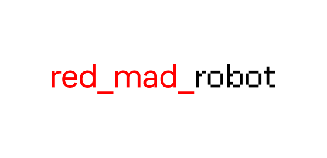

<!-- PROJECT LOGO -->
<br />
<p align="center">
  

  <h3 align="center">red_mad_robots</h3>

  <p align="center">
    Frontend repo for red_mad_robots new website
    <br />
    <br />
    <a href="https://rmr.sheverev.com/">Demo website</a>
  </p>
</p>


<!-- TABLE OF CONTENTS -->
<details open="open">
  <summary>Table of Contents</summary>
  <ol>
    <li>
      <a href="#about-the-project">About The Project</a>
      <ul>
        <li><a href="#design-links">Design Links</a></li>
        <li><a href="#built-with">Built With</a></li>
      </ul>
    </li>
    <li>
      <a href="#getting-started">Getting Started</a>
      <ul>
        <li><a href="#prerequisites">Prerequisites</a></li>
        <li><a href="#installation">Installation</a></li>
        <li><a href="#gitlab-variables">Gitlab Variables</a></li>
      </ul>
    </li>
    <li>
      <a href="#usage">Usage</a>
      <ul>
        <li><a href="#ssr">SSR</a></li>
        <li><a href="#aliases">Aliases</a></li>
        <li><a href="#folders-structure">Folders Structure</a></li>
        <li><a href="#metrics">Metrics</a></li>
        <li><a href="#styles-guide">Styles Guide</a></li>
        <li><a href="#breakpoints-guide">Breakpoints guide</a></li>
      </ul>
    </li>
    <li>
      <a href="#storybook-usage">Storybook</a>
      <ul>
        <li><a href="#run">Run</a></li>
        <li><a href="#settings">Settings</a></li>
        <li><a href="#controls">Controls</a></li>
        <li><a href="#stories">Stories</a></li>
        <li><a href="#storybook-congif">Storybook Config</a></li>
        <li><a href="#build">Build</a></li>
      </ul>
    </li>
    <li><a href="#acknowledgements">Acknowledgements</a></li>
  </ol>
</details>


<!-- ABOUT THE PROJECT -->
## About The Project

[![Product Name Screen Shot][product-screenshot]](https://example.com)

### Design Links
* [All pages](https://www.figma.com/file/66PuRS0hS6dov80ppusuHH/red_mad_robot)
* [Components library](https://www.figma.com/file/mlwmVF8CI9pfakOPqEQ8CW/red_mad_library)

### Built With

* [Next.js](https://nextjs.org/)
* [React](https://reactjs.org/)
* [Redux Wrapper for Next.js](https://github.com/kirill-konshin/next-redux-wrapper)
* [Interweave](https://github.com/milesj/interweave/tree/master/packages/core)
* [Less](https://github.com/less/less.js)


<!-- GETTING STARTED -->
## Getting Started

To get a local copy up and running follow these simple example steps.

### Prerequisites
* npm - follow instructions at [npmjs](https://www.npmjs.com/get-npm)

### Installation

1. Clone the repo
   ```sh
   git clone https://git.develophost.ru/rmr/rmr-react-frontend.git
   ```
2. Install NPM packages
   ```sh
   npm install
   ```
3. Create `.env.local` and copy content of `.env.example` into it. Make sure that `NEXT_PUBLIC_SITE_URL` is corresponding to your local url
   ```JS
   NEXT_PUBLIC_SITE_URL=http://your.domain.local 
   ```
4. Run development version with
   ```sh
   npm run dev
   ```
5. Build and run production version with
   ```sh
   npm run build
   npm run start
   ```

### Gitlab Variables

There are some variables you need to add to your ci beforehand:
* $API_URL - backend api url
* $APP_URL - domain, where fron will be hosted
* $GA_ID - google analytics id
* $YM_ID - yandex metrica id
* $SENTRY_DSN - sentry host
* $RECAPTCHA_SITE_KEY - recaptcha key for domain
* $PREVIEW_KEY - secret key for article

<!-- USAGE EXAMPLES -->
## Usage

### SSR
Don't forget that almost everything here is server side rendered, 95% of api calls are fired on `server` side. For more info on how to fetch data on server side read the [docs](https://nextjs.org/docs/basic-features/data-fetching#getserversideprops-server-side-rendering).

### Aliases
If you want to add new alias for a folder you can do it by adding
```js
config.resolve.alias['@your_alias'] = path.resolve(__dirname, 'path/to/folder')
```
to `next.config.js` in webpack config. 

Also you can add it to `jsconfig.json` for your ide to follow them:
```js
{
  "compilerOptions": {
    "paths": {
      ...
      "@your_alias/*": ["./path/to/folder/*"],
    }
  }
}
```

To use it just `import` it where you need it

```js
import AwesomeStuff from '@your_alias/AwesomeComponent';
```

### Folders Structure

    .
    ├── public                  # Public files (fonts, images, etc)
    │   ├── fonts               # Custom fonts
    │   ├── images              # Images... duh
    │   ├── static              # Static files like favicons, robots.txt, etc
    │   ├── video               # videos
    │   └── styles              # Core styles 
    ├── readme                  # Images for ReadMe
    ├── src                     # Source files
    │   ├── api                 # All methods for api calls
    │   ├── assets              # Demo data (idk if we need it now tho)
    │   ├── components          # Components and their stylesheets, all of them 
    │   ├── helpers             # Usefull hooks, functions and metrics
    │   │   └── adapters        # Data parsers for specific cases       
    │   ├── hoc                 # Wrapper for images and components for builder
    │   ├── pages               # Physical pages 
    │   └── store               # Everything about the store (actions, reducers)
    ├── server.js               # Custom server
    ├── .env.example            # Example of .env
    └── README.md               # <- You are here

### Metrics
To add new metric event you need to follow this 7 easy steps:
1. Go to `src/helpers/metrics.js` all logic is there waiting for you.

2. Check if `eventCategories` contains event's category, if not add a new one.

3. Check if `eventActions` contains event's  action-name, if not add a new one.

4. Check if `gaDmensions` contains all of the user's parameters, if there are new ones: add corresponding dimensions. If new parameter is an array you need to add it to `arrayNameKeys` as `Parameter_name: property_name`

5. Add new event to `eventList` with following structure:
    ```js
    YourNewEventLabel: {
      category: eventCategories.<event_category>,
      action: eventActions.<event_action>,
      label: 'YourNewEventLabel'
    }
    ```

6. Add `logEvent` call to component
    ```js
    logEvent('YourNewEventLabel', { property_name: property_value, ... })
    ``` 

7. Check if event is triggering and you can see logs in console.

### Styles Guide
All core styles are contained under `public/styles` folder. Component specific styles are usually placed inside component folder `src/components/Your_Component/Your_Component.less`. But all of the stylesheets imports are handled inside `public/styles/components.less`. If you need to add new component styles, you put the less file next to your component.js but import it inside `public/styles/components.less`, not `your_component.js`. For pages it's allt he same.

### Breakpoints Guide
```css
@break-point-xl: 1919.98px;
@break-point-lg: 1365.98px;
@break-point-md: 1023.98px;
@break-point-sm-min: 768px;
@break-point-sm: 767.98px;
@break-point-xs: 359.98px;
```

```css
@media (min-width: @break-point-xl) {
    1920+
}

@media (max-width: @break-point-xl) {
    1366 - 1919.98
}

@media (max-width: @break-point-lg) {
    1024 - 1365.98
}

@media (max-width: @break-point-md) {
    768 - 1023.98
}

@media (max-width: @break-point-sm) {
    375 - 767.98
}

@media (max-width: @break-point-xs) {
    0 - 377.98
}
```

### Hover Guide
There is a hover generator that disables hover on touch devices.
```less
.my-class{
  #hover({
    color:red
  });
}

// will turn into 

@media (hover: hover) and (pointer: fine) {
  .my-class :hover {
    color: red;
  }
}
```

<!-- STORYBOOK -->
## Storybook Usage

### Run
```
npm run storybook
```

### Settings

![Storybook][storybookControls-screenshot]

#### Controls

С помощью вкладки Controls, можно менять контент в компонентах. 
Меняя текст в полях, компонент будет автоматически обновляться.
Текст по умолчанию можно установить в ```/src/stories/<component_name>/```

```
export const ComponentName = TComponentName.bind({});
ComponentName.args = {
    content: "Текст", 
    title: 'Заголовок',
    name: 'Имя автора',
    position: 'Моя позиция',
}
```

### Stories
![Storybook][storybook-screenshot]
- Форма вакансии
- Скачивание файла
- Подписка на email
- Похожие статьи
- Расписание
- Подписка на Email
- Подписка на Email с кнопкой
- Три колонки с красным заголовком
- Цитата и текст
- Статистика
- Текст в две колонки
- Две колонки с заголовком
- Чекбокс
- Инпут 
- Описание ( D1, D2 )
- Заголовок ( H1, H2, H3, H4, H5 )
- Список
- Параграф ( P1, P2, P3)
- Цитата 
- X2
- Картинка + Картинка
- Фотография
- Слайдер
- Вертикальные картинки
- Видео 
- Видео встроенное ( YouTube, Vimeo )

### Storybook Config
- RMRTheme.js - Настройки темы, лого, цветов.
- preview.js - Настройки количества экранов, Redux стора и.т.п
- manager.js - Добавление темы
- main.js - Конфиг Webpback и Storybook


### Build
```
npm run build-storybook
```
После билда, будет создана папка ```storybook-static``` содержимое которой нужно положить в корень на любом сервере.


<!-- CI/CD -->
## Развертывание при помощи Gitlab CI в docker swarm
Для сборки и деплоя проекта необходим [Runner](https://docs.gitlab.com/runner/).

На GitLab в настройках CI/CD проекта идем в Variables и добавляем все необходимые секреты по списку, которые
необходимы в файле `.env.ci`.  
Так же добавляем в секреты внешний IP сервера [main](#mainserver) и SSH ключ.
+ `DOCKER_HOST_IP` - внешний IP сервера [main](#mainserver),
+ `GITLAB_ID_RSA` - ключ
> Предварительно необходимо сгенерировать пару для SSH и положить приватную часть на сервер.

> Обратите внимание, что секреты можно добавлять для двух окружений - `development` и `production`.

>Так же необходимо добавить `gitlab-deploy-token` в настройках репозитория:
> + Settings -> Repository -> Deploy Tokens
> + Вводим в `name` и `username` значение `gitlab-deploy-token`
> + Отмечаем `read_repository` и `read_registry`
> + Жмем `Create`


+ Пайплайн сборки и делоя на стейджинг происходит автоматически по коммиту в ветку `develop`.
+ Пайплайн сборки на продакшн происходит автоматически по коммиту в ветку `master`, деплой после сборки запускается вручную
  из интерфейса GitLab.
  


<!-- ACKNOWLEDGEMENTS -->
## Acknowledgements
* [Doc with events and metrics](https://docs.google.com/spreadsheets/d/1OrMiTQssIGKUKJI0WMC-6nPFhnJjX_EQo5P2IfyYcxw/edit#gid=0)
* [Swiper](https://swiperjs.com/react/)
* [Image lazy load](https://github.com/Aljullu/react-lazy-load-image-component)
* [Yandex metrika](https://github.com/narkq/react-yandex-metrika#readme)
* [Google Analytycs](https://github.com/react-ga/react-ga)
* [README for Backend](https://git.develophost.ru/rmr/rmr-strapi/blob/develop/README.md)

<!-- MARKDOWN LINKS & IMAGES -->
<!-- https://www.markdownguide.org/basic-syntax/#reference-style-links -->
[product-screenshot]: readme/screenshot.png
[storybook-screenshot]: readme/storybook.png
[storybookControls-screenshot]: readme/storybook-controls.png
